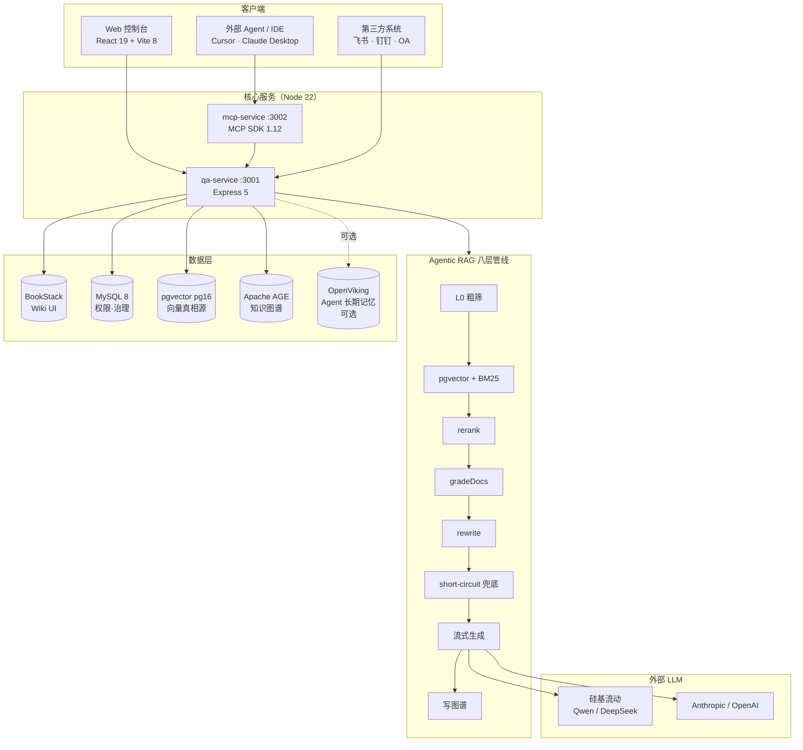

# 知源 · ZhiYuan · Knowledge Platform

> 企业级**私有化 + 多模态 + 国产化适配**的 AI 原生知识平台。
> 把分散在 Wiki、PDF、合同、邮件、图纸里的"沉默知识"变成带原文引用、带权限审计、可问可写的问答系统。
>
> 五容器 Docker 一键起栈 · 30 分钟私有化上线 · 数据零外传。

---

## ✨ 八大差异化能力

1. **数据主权 · 五容器私有栈** —— BookStack + MySQL 8 + pgvector pg16 + Apache AGE + qa-service，一条 docker-compose 起完，数据/向量/对话/审计日志全部留在内网。
2. **国产大模型原生适配** —— 硅基流动 Qwen-VL-72B / 通义 / DeepSeek / Anthropic Claude / OpenAI 五路可切，env 一行配置。
3. **多模态问答（PDF Pipeline v2）** —— `@opendataloader/pdf` 结构化解析 + Qwen2.5-VL-72B 视觉 caption，扫描合同 / 图表 / 财报 PPT 都能问答命中。
4. **知识图谱自生长（Apache AGE）** —— 每次问答 fire-and-forget 写入 `CITED / CO_CITED` 边，自动绘制"谁在引用谁"的知识地图。
5. **Permissions V2** —— 三主体（role / user / team）× allow|deny × TTL × 双维资源（source_id / asset_id），deny 优先，老 role 字段回退兼容，全量审计。
6. **MCP 开放协议** —— 独立 mcp-service，stdio + streamable HTTP 双 transport，**8 个工具全部生产可用**（搜索 / 页面 / 召回 / 路径 / 标签 / 行动），Cursor / Claude Desktop 即插即用。
7. **L0/L1 分级摘要 + RAG 八层兜底** —— ingest 阶段为每个 chunk 生成 L0 一句话摘要 + L1 概览（Qwen2.5-72B + JSON 强制输出），RAG 在精检索之前先用 L0 ANN 粗筛收窄候选 asset。GM-LIFTGATE32 实测召回 **+2.7pp**（recall@5 0.973 → 1.000）。
8. **工程执行力 · 四阶段 AI 协作流水线** —— Superpowers + OpenSpec 四阶段工作流（Explore → Lock → Execute → Archive），永不覆盖的 ADR + 冻结 Spec 三件套。**33 条 ADR + 21 个冻结 Spec + 21 个归档 change** 全可追溯。

---

## 🏗️ 架构总览



四层从上到下：客户端 → 核心服务 → 推理管线 → 数据/LLM。详见 [`docs/PROJECT_OVERVIEW.md`](docs/PROJECT_OVERVIEW.md)。

---

## 🧰 技术栈

| 层 | 选型 |
|---|---|
| 前端 | React 19 + Vite 8 + Tailwind 4 + TanStack Query + React Router 7 |
| 后端 | Node 22 + Express 5 + TypeScript 6（严格模式 / `tsc --noEmit` 双 0） |
| 数据库 | MySQL 8（BookStack + 治理）/ PostgreSQL 16 + pgvector / Apache AGE 1.6 |
| Wiki | BookStack（linuxserver 镜像，原生权限 + Markdown） |
| LLM | 硅基流动 Qwen2.5-72B / Qwen2.5-VL-72B（默认）· Anthropic Claude · OpenAI 兼容 |
| Embedding | Qwen3-Embedding-8B（默认）· OpenAI text-embedding-3 |
| 协议 | Model Context Protocol（MCP SDK 1.12）/ REST + JWT 双栈（HS256 + JWKS） |
| 测试 | Vitest + supertest + node:test（纯函数烟测） |

---

## 📁 仓库结构

```
knowledge-platform/                     pnpm workspace · monorepo
├─ apps/
│  ├─ web/                              React 19 控制台（11 个模块）
│  ├─ qa-service/                       核心 API（25+ 路由模块）
│  ├─ mcp-service/                      MCP 协议层（8 工具，stdio + HTTP）
│  └─ openviking-service/               OpenViking sidecar（可选实验）
├─ infra/
│  ├─ docker-compose.yml                5 容器 + openviking profile
│  ├─ {bookstack_data,mysql_data,pg_data,kg_data,asset_images}/   持久化卷
│  └─ .env                              生产密钥（不进仓库）
├─ scripts/
│  ├─ dev-up.sh / dev-down.sh           本机开发栈一键起停
│  ├─ eval-recall.mjs                   召回率评测
│  ├─ backfill-l0.mjs                   L0 摘要回填（断点续跑）
│  ├─ verify-viking.mjs                 OpenViking sidecar 烟测
│  └─ ...                               20+ 工程脚本
├─ openspec/changes/                    21 个冻结的行为契约
├─ docs/
│  ├─ PROJECT_OVERVIEW.md               项目总览（汇报用）
│  ├─ workflows/                        四阶段流水线手册
│  ├─ verification/                     各 change 验收手册
│  ├─ integrations/mcp-quickstart.md    MCP 接入指南（Cursor / Claude Desktop）
│  ├─ marketing/知识库/                  白皮书 + Pitch Deck（v1.1）
│  └─ superpowers/{specs,plans,archive}/ 设计草稿 / 实现计划 / 归档
├─ eval/                                Golden set 数据集（GM-LIFTGATE32 等）
└─ .superpowers-memory/                 共享项目记忆
   ├─ decisions/                        33 条 ADR（永不覆盖）
   ├─ integrations.md                   跨服务对接真相源
   ├─ glossary.md                       业务名词
   └─ PROGRESS-SNAPSHOT-*.md            按日期 progress 快照
```

---

## 🚀 快速开始（本机开发）

### 前置条件

- Docker Desktop（MySQL / pgvector / AGE / BookStack 跑容器里）
- Node.js **22+**（用 `--experimental-strip-types` 直跑 TS）
- pnpm 10+
- Java 17+（PDF v2 用 `@opendataloader/pdf` 解析；缺 Java 自动降级到平文本）
- 任一 LLM Key（推荐**硅基流动**，免外网）

### 三步起栈

```bash
# 1. 克隆 + 装依赖
git clone <repo-url>
cd knowledge-platform
pnpm install

# 2. 配置密钥（生产 secret 不进仓库）
cp apps/qa-service/.env.example apps/qa-service/.env
# 编辑 .env 填入：
#   EMBEDDING_API_KEY=sk-...           硅基流动 key
#   BOOKSTACK_TOKEN_ID / SECRET        启动后第一次到 http://localhost:6875 创建
#   ANTHROPIC_API_KEY 或 OPENAI_API_KEY 任选

# 3. 一键起栈（Docker 基础设施 + qa-service + web，全部后台）
pnpm dev:up
pnpm dev:status   # 看 PID / 端口 / 健康检查
pnpm dev:logs     # tail -f 全部日志
```

起来后浏览器开 **http://localhost:5173**，初次登录 `admin@dsclaw.local / admin123`（首次启动 `ensureDefaultAdmin` 自动创建）。

### 服务端口

| 服务 | URL | 端口 |
|---|---|---|
| Web 控制台 | http://localhost:5173 | 5173 |
| qa-service API | http://localhost:3001 | 3001 |
| mcp-service（HTTP，可选） | http://localhost:3002/mcp | 3002 |
| BookStack Wiki | http://localhost:6875 | 6875 |
| MySQL | localhost:3307 | 3307 |
| pgvector | localhost:5432 | 5432 |
| Apache AGE | localhost:5433 | 5433 |
| OpenViking（可选） | http://localhost:1933 | 1933 |

### 停 / 重启

```bash
pnpm dev:down                 # 停 qa-service / web，保留 docker
pnpm dev:down --all           # 连 docker 一起停
pnpm dev:restart              # 等价 dev:down && dev:up
pnpm dev:logs qa-service      # tail 单个服务日志
```

---

## 🐳 完整部署（docker-compose）

生产 / 演示环境推荐全容器化：

```bash
# 构建镜像（首次约 5 分钟，含 PDF v2 的 Java 17 装机）
pnpm stack:build

# 拉起所有容器（含 qa-service）
pnpm stack:up

# 状态检查
docker compose -f infra/docker-compose.yml ps

# 停
pnpm stack:down
```

容器：

```
bookstack       Wiki UI            :6875
bookstack_db    MySQL 8            :3307
pg_db           pgvector pg16      :5432
kg_db           Apache AGE 1.6     :5433
qa_service      核心 API            :3001
openviking      Agent 长期记忆      :1933   profile=viking 默认不启动
```

启用 OpenViking sidecar（**可选实验，ADR-31**）：

```bash
VIKING_ENABLED=1 docker compose -f infra/docker-compose.yml --profile viking up -d openviking
```

---

## 🖥️ 服务器配置要求

> **关键差异化**：LLM / Embedding / Reranker **全走外部 API**（硅基流动 / 通义 / Anthropic），**主机不需要 GPU**。这是本架构相比其它 RAG 平台最省钱的差异化点。
> 如客户红线要求"完全私有 LLM"，参见下方 §国产化适配。

### 配置矩阵

| 维度 | 🟢 起步 / 演示 | 🟡 小型生产 | 🟠 中型生产 | 🔴 集团级 |
|---|---|---|---|---|
| **场景** | demo · POC · 1 部门 ≤10 用户 · ≤5k chunks | 单 BU · 50–100 用户 · 20–100k chunks | 跨 BU · 500–1000 用户 · 200–800k chunks | 全集团 · 5000+ 用户 · 5M+ chunks |
| **CPU** | 4 核 | 8 核 | 16 核 | DB 32 核 / App 16 核 ×N |
| **内存** | 8 GB | 16 GB | 32 GB | DB 128 GB / App 32 GB ×N |
| **磁盘** | 50 GB SSD | 200 GB SSD | 500 GB NVMe | 1–2 TB NVMe + 备份盘 |
| **网络** | 100 Mbps | 1 Gbps | 1 Gbps + 双链路 | 10 Gbps 内网 |
| **架构** | 单机 5 容器 | 单机 5 容器 | 单机 5 容器 + 监控 | DB 专机 + App 集群 |
| **并发问答** | 1–2 QPS | 5–10 QPS | 30–50 QPS | 100+ QPS（横向扩 qa-service） |
| **首次 ingest** | 30 PDF/小时 | 200 PDF/小时 | 1000 PDF/小时 | 专用 ingest worker |
| **典型客户** | 个人 / 团队试用 | 律所 / 1 个事业部 | 大型企业某条业务线 | 国央企 / 集团总部 |
| **月成本估算** | 云主机 200–300 元 | 云主机 800–1500 元 | 云主机 3000–5000 元 | 自有机房 + 备份 |

### 内存占用拆解（以小生产档 16 GB 为例）

```
组件                                    idle    ingest 峰值
────────────────────────────────────────────────────────
PostgreSQL + pgvector (pg_db)           1.5 GB  2.5 GB
PostgreSQL + Apache AGE (kg_db)         0.8 GB  1.2 GB
MySQL 8 (BookStack + governance)        1.5 GB  2.0 GB
BookStack PHP-FPM + nginx               0.5 GB  0.7 GB
qa-service (Node 22)                    0.6 GB  1.2 GB
Java 17 (PDF Pipeline ODL)              空闲不起 1.5 GB
Docker overhead + OS                    1.0 GB  1.0 GB
────────────────────────────────────────────────────────
合计                                     5.9 GB  10.1 GB
余量（缓存 / 突发 / 监控）                  10 GB    6 GB
```

idle 状态 6 GB 就够，**ingest 含图 PDF 时峰值到 10 GB**——16 GB 这一档的余量正是为这个峰值留的。

### 磁盘构成（以小生产档 200 GB 为例）

```
组件                                    估算
────────────────────────────────────────
Docker images（5 个容器）                4 GB
PostgreSQL pg_data（vector + chunks）    30 GB（按 100k chunks 估）
PostgreSQL kg_data（AGE 知识图谱）       5 GB
MySQL bookstack_data + 治理表            10 GB
BookStack uploads（附件、Wiki 图）       20 GB
infra/asset_images（PDF 抽出的图）       50 GB（含图 PDF 大头）
日志（qa-service / nginx / pg）          20 GB
备份 / 快照预留                          50 GB
余量                                     11 GB
────────────────────────────────────────
合计                                     200 GB
```

**真正占空间的是 `infra/asset_images/`**——含图 PDF 抽出的图字节落盘是大头。如果不上多模态（关闭 `INGEST_VLM_ENABLED`），削掉 30 GB 用 150 GB 配置即可。

### 国产化适配（客户红线场景）

**OS**：麒麟 V10 / 统信 UOS / openEuler 22 都已验证 Docker + Node 22 + PG 16

**CPU 兼容**：x86_64（Intel / AMD / 海光）/ ARM64（鲲鹏 / 飞腾）都跑得通

> ⚠️ pgvector 0.8.2 / Apache AGE 1.6 在 ARM64 上需自行编译（官方镜像 tag 不一定全）；Java 用 OpenJDK 17 而非 Oracle JDK（许可证）

**LLM 私有部署 GPU 需求**（客户禁止外发 API 时另算服务器，**不算在主应用机**）：

| 模型 | 推理 GPU | 备注 |
|---|---|---|
| Qwen2.5-7B-Instruct | 1× A10 / 4090 | 速度够，7B 答题质量略弱 |
| Qwen2.5-32B-Instruct | 1× A100-80G 或 2× 4090 | 性价比甜区 |
| Qwen2.5-72B-Instruct | 2× A100-80G 或 4× 4090 | 旗舰，对应默认配置 |
| Qwen2.5-VL-72B-Instruct | 2× A100-80G | 多模态（PDF 图理解） |
| 华为昇腾 910B | 等价 A100 | 国央企硬指标场景 |

**Embedding 私部署**：Qwen3-Embedding-8B 单张 24G（A10 / 4090）即可，约 1500 QPS。

### 起步推荐（报价用）

客户说"先试一段时间，能跑就行"——直接报这套：

```
云主机：
  CPU:    4 核（Intel Xeon Platinum 或鲲鹏 920 等价）
  RAM:    8 GB
  磁盘:   50 GB SSD
  网络:   5 Mbps 公网（连硅基流动 API）
  GPU:    无需

OS:           Ubuntu 22.04 / 麒麟 V10
Docker:       24+
Compose:      v2

参考价位（阿里云 / 华为云 / 腾讯云）：
  按量:        1.5–2 元/小时
  包月:        250–350 元/月
```

**这一档够跑 30 分钟私有化上线演示，未来涨到 20k chunks 都不用扩**——CPU 8 核 / 16 GB 才是真生产甜区。

---

## 🔑 环境变量速查

完整列表见 [`apps/qa-service/.env.example`](apps/qa-service/.env.example)。最关键的：

| 变量 | 说明 |
|---|---|
| `EMBEDDING_API_KEY` / `EMBEDDING_BASE_URL` | 硅基流动 / OpenAI 兼容协议（默认硅基） |
| `BOOKSTACK_TOKEN_ID` / `BOOKSTACK_TOKEN_SECRET` | BookStack API（qa-service 用） |
| `BOOKSTACK_MCP_TOKEN` | BookStack 只读 token（mcp-service 专用） |
| `AUTH_JWKS_URL` 或 `AUTH_HS256_SECRET` | JWT 双栈，**生产至少配一个**否则 fail-fast 退出 |
| `INGEST_VLM_ENABLED` | 默认 false；开启后 image-heavy 页走 Qwen2.5-VL caption |
| `HYBRID_SEARCH_ENABLED` | 默认 false；开启后 pgvector + BM25 并行召回 + RRF 融合 |
| `KG_ENABLED` | 默认 true；关闭后 AGE 写入全部 no-op |
| `L0_GENERATE_ENABLED` | 默认 true；ingest 阶段是否生成 L0/L1 摘要 |
| `L0_FILTER_ENABLED` | 默认 false；RAG 是否启用 L0 粗筛阶段（eval 通过后再开） |
| `VIKING_ENABLED` | 默认 false；是否启用 OpenViking 长期记忆（ADR-31 实验） |

---

## 📚 文档导航

| 文档 | 看什么 |
|---|---|
| [`docs/PROJECT_OVERVIEW.md`](docs/PROJECT_OVERVIEW.md) | 项目总览（汇报 / 面试用） |
| [`docs/integrations/mcp-quickstart.md`](docs/integrations/mcp-quickstart.md) | MCP 接入指南（Cursor / Claude Desktop / curl 三步通） |
| [`docs/workflows/README.md`](docs/workflows/README.md) | 四阶段 AI 协作工作流操作手册 |
| [`docs/marketing/知识库/`](docs/marketing/知识库/) | 白皮书（v1.1）+ Pitch Deck + 一页纸 |
| [`docs/verification/`](docs/verification/) | 各 change 的验收手册 |
| [`openspec/changes/`](openspec/changes/) | 21 个冻结行为契约 |
| [`.superpowers-memory/decisions/`](.superpowers-memory/decisions/) | 33 条 ADR（永不覆盖） |
| [`.superpowers-memory/integrations.md`](.superpowers-memory/integrations.md) | 跨服务对接真相源 |
| [`CLAUDE.md`](CLAUDE.md) | AI 协作约定 + 工作流命令 |

---

## 🤝 工作流约定

本仓库使用 **Superpowers + OpenSpec 四阶段流水线**（详见 [`docs/workflows/README.md`](docs/workflows/README.md)）：

| ID | 命令 | 场景 |
|---|---|---|
| A | `openspec-superpowers-workflow` | 全新 P0、需求不清 |
| B | `superpowers-openspec-execution-workflow` | 有上游依赖的 P1 |
| C | `superpowers-feature-workflow` | 独立 UI 细节 |
| D | `openspec-feature-workflow` | 只产接口契约 |

每次 AI 会话**第一句必须写明工作流名称**，否则 AI 会跳过 spec 直接写代码。详见 `CLAUDE.md`。

---

## 🩺 健康自检

```bash
# 1. TypeScript 双 0
pnpm -r exec tsc --noEmit

# 2. 单测全跑
pnpm -r test

# 3. RAG 召回 eval（GM-LIFTGATE32）
node --experimental-strip-types scripts/eval-recall.mjs eval/gm-liftgate32-v2.jsonl

# 4. MCP 工具列表
curl -fsS http://localhost:3001/api/mcp/health
```

---

## 📝 License & 联系

本项目为商业项目内部代码库，未授权请勿转发。如需 demo / 试点合作，邮箱：`hello@zhiyuan.ai`。

---

> **当前版本**：v1.1（2026-04-26 修订）· 33 ADR · 21 OpenSpec · 21 归档 change
> 最近一次 PROGRESS-SNAPSHOT 见 [`.superpowers-memory/PROGRESS-SNAPSHOT-2026-04-26-l0-abstract.md`](.superpowers-memory/PROGRESS-SNAPSHOT-2026-04-26-l0-abstract.md)
