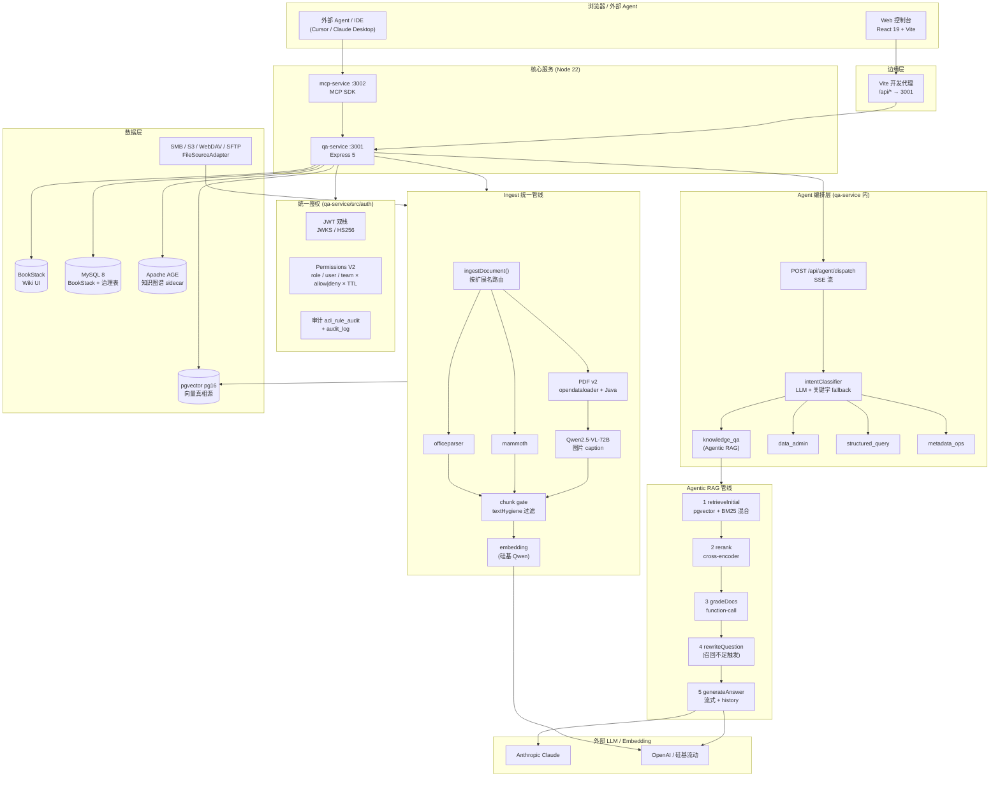

# knowledge-platform · 项目总览

> 一份给新人 / 面试官 / 汇报用的总览。信息源：`README.md`、`package.json`、`infra/docker-compose.yml`、`apps/*/src/`、`.superpowers-memory/`（27 条 ADR + 3 份 progress snapshot）、`openspec/changes/` 下 20 个已冻结 change。
> 生成日期：2026-04-23。

---

## 1. 是什么

一个**企业级知识管理 + Agentic RAG 问答平台**。把传统的 BookStack Wiki 升级成一套可审计、可治理、可扩展的知识底座：

- **上层**：React 19 + Vite 8 Web 控制台（Overview / Spaces / Ingest / QA / Agent / Governance / IAM / Eval / Notebooks / MCP / Assets 11 个模块）
- **中台**：`qa-service`（Node 22 + Express 5）提供 RAG、Agent 编排、Ingest、治理、权限、审计 API
- **协议层**：独立的 `mcp-service` 暴露 Model Context Protocol（stdio + streamable HTTP 双通道），给外部 Agent / IDE 消费
- **底座**：BookStack（Wiki UI + Markdown 渲染）+ MySQL（BookStack 原生 + 治理扩展表）+ PostgreSQL/pgvector（向量检索真相源）+ Apache AGE（知识图谱 sidecar）

核心卖点：**"BookStack 的 UI + 企业级向量检索 + 可插拔 Agent + 完整权限与审计"**，离线可部署，国产 LLM / Embedding 友好（硅基流动 Qwen2.5-VL-72B）。

## 2. 代码规模 & 工程结构

```
knowledge-platform/                      pnpm workspace，monorepo
├─ apps/
│  ├─ web/            React 19 + Vite + Tailwind + react-query + react-router 7
│  ├─ qa-service/     Express 5 / Node 22（~9,578 行 services+routes）/ 20+ 路由模块
│  └─ mcp-service/    MCP SDK 1.12 · 2 个工具（search_knowledge / get_page_content）
├─ infra/docker-compose.yml              5 个容器（bookstack / bookstack_db / pg_db / kg_db / qa_service）
├─ scripts/                              dev-up / dev-down / eval-recall / cleanup-bad-chunks …
├─ openspec/changes/                     20 个已冻结行为契约（RBAC / RAG / PDF v2 / Permissions v2 / AGE …）
├─ docs/
│  ├─ workflows/                         四阶段流水线操作手册
│  ├─ superpowers/{specs,plans,archive}  设计草稿 / 实现计划 / 归档
│  └─ verification/                      各 change 的验收手册
└─ .superpowers-memory/                  共享项目记忆（27 ADR + progress snapshot + glossary + open-questions）
```

`tsc --noEmit` 可过（web 仅 5 处 pre-existing React 19 类型遗留），qa-service 本机 `pnpm test` 207/209 通过。

## 3. 部署方式

### 3.1 本地开发（单命令起栈）

```bash
pnpm dev:up         # 拉起 docker 基础设施 + qa-service + web（全后台，日志在 .dev-logs/）
pnpm dev:status     # 看 PID / 端口 / 容器 health
pnpm dev:logs       # tail -f 所有日志
pnpm dev:down       # 优雅停
```

`scripts/dev-up.sh` 做了三件事：
1. `docker compose up -d bookstack_db pg_db bookstack` 拉起容器；
2. 用 `nc` 轮询 MySQL:3307 / Postgres:5432 健康；
3. `nohup pnpm --filter qa-service dev` + `--filter web dev` 启动前后端。

服务地址：

| 服务 | URL | 端口 |
|---|---|---|
| Web 控制台 | http://localhost:5173 | 5173 |
| qa-service API | http://localhost:3001 | 3001 |
| mcp-service（可选 HTTP） | http://localhost:3002/mcp | 3002 |
| BookStack | http://localhost:6875 | 6875 |
| MySQL | localhost:3307 | 3307 |
| pgvector | localhost:5432 | 5432 |
| Apache AGE | localhost:5433 | 5433 |

### 3.2 容器化部署（infra/docker-compose.yml）

五个服务一张 compose：

- `bookstack`：linuxserver/bookstack（挂 `./bookstack_data`）
- `bookstack_db`：mysql:8.0（挂 `./mysql_data`，30 秒健康检查）
- `pg_db`：pgvector/pgvector:pg16（挂 `./pg_data`）
- `kg_db`：apache/age:release_PG16_1.6.0（挂 `./kg_data`，图谱 sidecar，5433）
- `qa_service`：由 `apps/qa-service/Dockerfile` 构建，`node:22-bookworm-slim` + `openjdk-17-jre-headless`（PDF 解析需 Java），pnpm 10 + workspace filter 安装

所有密钥通过 `infra/.env` 注入（ANTHROPIC/OPENAI/EMBEDDING API key、BookStack token 等），不进仓库。

命令：

```bash
pnpm stack:build    # 构建所有镜像
pnpm stack:up       # 后台拉起
pnpm stack:down     # 停
```

### 3.3 配置开关（feature flags）

| Flag | 默认 | 作用 |
|---|---|---|
| `KG_ENABLED` | on | 关闭后 KG 写入全部 no-op（容器未起也自动降级） |
| `SPACE_PERMS_ENABLED` | on | 关闭后 space 级 ACL 规则不参评，回退到 V1 行为 |
| `INGEST_VLM_ENABLED` | off | 打开后 image-heavy 页走 Qwen2.5-VL caption |
| `HYBRID_SEARCH_ENABLED` | off | 打开后 pgvector + 关键词并行召回 |
| `RAG_RELEVANCE_WARN_THRESHOLD` | 0.1 | rerank top-1 低于此值 emit WARN |
| `RAG_NO_LLM_THRESHOLD` | 0.05 | 低于此值直接兜底（防乱码 context 毒化 LLM） |

---

## 4. 架构图



*四层从上到下：客户端 → Express 路由 → 核心业务（编排 / RAG / Ingest / Auth）→ 数据与外部 LLM。*

### 请求走向（以"提问"为例）

1. Web 发起 `POST /api/agent/dispatch` → qa-service 统一鉴权（JWT + Permissions V2 + TTL）
2. `intentClassifier` 结构化输出 → `knowledge_qa` Agent
3. 进 RAG 管线：pgvector 召回（或 hybrid）→ cross-encoder rerank → LLM `gradeDocs` → 低召回时 `rewriteQuestion` 重试
4. 通过 SSE 流式把 `rag_step / citations / token` 事件推回前端
5. 命中的 chunk id / question id / asset id 异步写入 Apache AGE（`CITED` / `CO_CITED` 边）做引用图谱
6. 审计日志落 `audit_log`；ACL 规则变更落 `acl_rule_audit`

---

## 5. 项目亮点（可以在汇报里强调）

下面每条都对应仓库内可追溯的 ADR / openspec change / 代码位置，不是嘴炮。

### 5.1 🏗️ 工程方法论：四阶段流水线（这一条特别值得讲）

仓库自研 / 固化了一套 **`Superpowers + OpenSpec`** 的四阶段 AI 协作工作流（见 `docs/workflows/README.md`、`CLAUDE.md`）：

| ID | 命令 | 场景 | 是否 OpenSpec | 是否写码 |
|----|------|------|---------------|---------|
| A | `openspec-superpowers-workflow` | 需求模糊的全新 P0 | 有 | 有 |
| B | `superpowers-openspec-execution-workflow` | 依赖清楚的 P1 | 有 | 有 |
| C | `superpowers-feature-workflow` | 独立 UI 小改 | 无 | 有 |
| D | `openspec-feature-workflow` | 只产接口契约 | 有 | 无 |

产物分层：`docs/superpowers/specs/`（草稿）→ `openspec/changes/`（锁定的行为契约）→ `docs/superpowers/archive/`（归档）+ `.superpowers-memory/decisions/`（永不覆盖的 ADR）。目前 **27 条 ADR + 20 个冻结 change + 21 个归档**，每一步决策都可回溯。

> 面试 / 汇报时可以说："这个仓库不是靠注释保真相，而是靠 `ADR + OpenSpec + Progress Snapshot` 三件套做项目级记忆，换人或换 AI 上下文都能续接。"

### 5.2 🧠 Agentic RAG（非朴素向量召回）

`apps/qa-service/src/services/ragPipeline.ts` 不是"embed + top-K + stuff prompt"三板斧，它做了七层兜底：

1. **自适应 top-K**：短查询/缩写题 → 5；复合对比类 → 15；默认 10
2. **混合召回**：`HYBRID_SEARCH_ENABLED` 打开时 pgvector + BM25 并行，RECALL_TOP_N 拉宽再 rerank 回 TOP_K
3. **Cross-encoder rerank**：`services/reranker.ts`，失败降级到纯向量
4. **LLM gradeDocs**：function-call 结构化评分，保底保留 Top 2
5. **低召回自动 rewrite**：gradedDocs.length < 3 触发问题重写再召回
6. **D-007 short-circuit**：top-1 < `RAG_NO_LLM_THRESHOLD` 直接兜底，**不让 LLM 被烂 context 毒化**（来自 BUG-01 的真实根因修复）
7. **D-008 scope 豁免**：Notebook 等用户显式 scope 场景跳过 short-circuit，交还 LLM

相关 ADR：`2026-04-23-22-rag-relevance-hygiene-lock.md` / `2026-04-23-24-bugbatch-h-notebook-shortcircuit.md`。

### 5.3 📄 PDF Pipeline v2（ODL + VLM）—— 对扫描件 / 图文混排特别友好

`apps/qa-service/src/services/pdfPipeline/`：

- 解析引擎 `@opendataloader/pdf`（Java CLI，软依赖动态 import）；启动时 `java -version` 探测，缺 Java 降级到 PDFParse 平文本
- 结构化输出 heading / paragraph / table chunks + 图片落档（`infra/asset_images/`，`metadata_asset_image` 唯一键）
- **VLM caption**：只对 image-heavy 页（chars<300 或 imageCount≥3）调 `Qwen/Qwen2.5-VL-72B-Instruct`（硅基复用 EMBEDDING_API_KEY），caption 进向量索引，扫描件 PDF 也能被问答命中
- 完整降级链：ODL 挂 → PDFParse；VLM 挂 → chunk 保留但无 caption

### 5.4 🛡️ Permissions V2（三主体 × TTL × deny 最高优 × 团队 × Notebook 共享）

业界很多系统权限只做到 RBAC，这里做到了：

- **主体**：`subject_type ∈ {role, user, team}` + 通配 `*`，老 role 字段回退兼容
- **效果**：allow / deny，**deny 优先级最高**
- **TTL**：`expires_at` + `notExpired()` 过滤
- **资源双维**：`source_id` / `asset_id`（asset 命中同 source 的规则）
- **团队**：`team` + `team_member`，`requireAuth` 注入 `principal.team_ids`
- **Notebook 共享**：`notebook_member` 表，accessibility = owner ∪ 直授 ∪ 团队授；`GET /api/notebooks` 返回 `{items, shared}` 分段
- **审计**：新建 `acl_rule_audit` 表，记录结构化 `before_json / after_json` diff；写失败不阻塞业务
- **R-1 双轨**：新装机严格种子只下 `admin` 三权限；升级机保留老 `role='*'` 行并 WARN 一次

### 5.5 🔌 统一 Ingest + 多源文件接入

`services/ingestPipeline/index.ts` 是**唯一入口**，按扩展名路由到 6 种 extractor，所有上传 / 批量扫描 / 文件服务器共用这条管线。

`services/fileSource/` 抽象了 `FileSourceAdapter` 接口（`init / listFiles / fetchFile / close`）：
- 本轮实现 **SMB**（`@marsaud/smb2`）
- 预留 S3 / WebDAV / SFTP 工厂位
- AES-256-GCM 加密凭据（`MASTER_ENCRYPT_KEY`），API 返回前 `redactConfig` 打码
- `node-cron` 调度 + `withSourceLock` 同源串行
- 软删 `metadata_asset.offline=true`，检索自动过滤

### 5.6 🕸️ Knowledge Graph（Apache AGE sidecar）

ADR-27 新加的能力：

- 独立 PG 容器跑 AGE 1.6.0（PG16），和主 pgvector 隔离可独立下架
- 节点：Asset / Source / Space / Tag / Question
- 边：CONTAINS / SCOPES / HAS_TAG / **CITED / CO_CITED**（用户每次问答都 fire-and-forget 写入）
- DetailGraph 前端读真实邻域，无数据时回退 mock，不影响主流程
- `KG_ENABLED=0` 一键降级，容器未起也自动 no-op

### 5.7 🧭 Agent 编排层（可插拔意图路由）

`POST /api/agent/dispatch` SSE：
- LLM 结构化意图识别 + 关键字 fallback，阈值 `AGENT_INTENT_THRESHOLD=0.6`
- 4 个已注册 Agent：`knowledge_qa` / `data_admin` / `structured_query` / `metadata_ops`
- 旧 `POST /api/qa/ask` 降级为 `hint_intent=knowledge_qa` 的薄壳，**向后兼容**
- 新增 SSE 事件 `agent_selected`，旧客户端自动忽略

### 5.8 📡 MCP Service（对外协议层）

`apps/mcp-service/` 独立进程，两种 transport：
- `StdioServerTransport`（默认，给 Claude Desktop / Cursor）
- `StreamableHTTPServerTransport`（`--http`，给远程 Agent，`/mcp` endpoint）

两个工具：`search_knowledge` / `get_page_content`，复用 BookStack 只读 token（`BOOKSTACK_MCP_TOKEN`）——**和 qa-service 的写 token 账号隔离**，对外协议最小权限。

### 5.9 🧪 Eval & 可观测性

- `scripts/eval-recall.mjs` + `apps/qa-service/src/services/evalRunner.ts` + Web `/eval` 页面，支持 Dataset → Run 全流程
- 所有 ingest 完成 emit `event:'ingest_done'` 结构化日志（assetId/extractorId/chunks/images/duration_ms/warnings）
- RAG 每步 emit `rag_step` SSE（含 initial_count / kept_count / citations），调试可直接 F12 看
- Governance 模块：`tags` / `duplicates` / `quality` / `audit-log` 四个子路由，治理指标跟业务分离

### 5.10 🔁 降级友好（Graceful Degradation 贯穿全栈）

列一下全栈 fallback，这是这个项目"能跑"最核心的底气：

| 组件 | 缺失时 |
|---|---|
| JWKS / HS256 都没配 | DEV BYPASS 注入 dev principal；生产启动 fail-fast |
| Java | PDF v2 → PDFParse 平文本 |
| VLM | caption 为空，chunk 不丢 |
| Reranker | 纯向量召回继续 |
| Apache AGE | runCypher no-op，主流程不阻塞 |
| node-cron | 调度关闭但手动扫描仍能用 |
| SMB 库未装 | types 有 stub，tsc 仍过 |

---

## 6. 面试 / 汇报一句话版

> "这是一个基于 BookStack 的企业知识库 + Agentic RAG 平台。五容器 Docker 一键起（BookStack / MySQL / pgvector / Apache AGE / qa-service），前端 React 19 + Vite，后端 Node 22 + Express 5。亮点在 **Agentic RAG 七层兜底**、**PDF v2 + VLM**、**三主体 × TTL × deny 优先的 Permissions V2**、**SMB 起步的 FileSourceAdapter**、**Apache AGE 做引用图谱**、以及一套 **`Superpowers + OpenSpec` 四阶段 AI 协作工作流** —— 27 条 ADR、20 个冻结 spec 全可追溯。"

---

## 7. 延伸阅读

- 工作流操作手册：`docs/workflows/README.md`
- 最新进度：`.superpowers-memory/PROGRESS-SNAPSHOT-2026-04-23.md`
- 跨服务真相源：`.superpowers-memory/integrations.md`
- 业务名词：`.superpowers-memory/glossary.md`
- RAG 相关 ADR：`2026-04-21-01` / `2026-04-23-22` / `2026-04-23-24`
- 权限相关 ADR：`2026-04-22-16` / `2026-04-23-17` / `2026-04-23-26`
- Knowledge Graph ADR：`2026-04-23-27`
