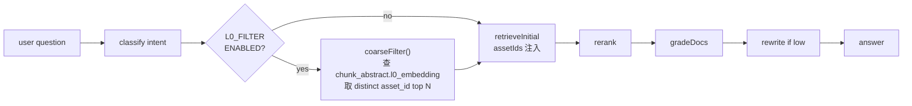

# Ingest L0/L1 Abstract — Design

> 配套 explore.md。本文件描述技术细节；行为契约见 `openspec/changes/ingest-l0-abstract/specs/`。

---

## 1. 数据模型

```sql
CREATE TABLE IF NOT EXISTS chunk_abstract (
  id            SERIAL PRIMARY KEY,
  chunk_id      INT NOT NULL REFERENCES metadata_field(id) ON DELETE CASCADE,
  asset_id      INT NOT NULL REFERENCES metadata_asset(id) ON DELETE CASCADE,
  l0_text       TEXT NOT NULL,
  l0_embedding  vector(4096),       -- 同现有 metadata_field.embedding 维度
  l1_text       TEXT,                -- 可空：单 chunk 太短时只生成 L0
  generator_version VARCHAR(32) NOT NULL DEFAULT 'v1',
  generated_at  TIMESTAMP NOT NULL DEFAULT NOW(),
  UNIQUE (chunk_id)
);

CREATE INDEX IF NOT EXISTS idx_chunk_abstract_asset ON chunk_abstract(asset_id);
-- HNSW > IVFFLAT，但保持和现有 idx_field_embedding 一致用 ivfflat（pgvector pg16 即装即用）
CREATE INDEX IF NOT EXISTS idx_chunk_abstract_l0_embedding
  ON chunk_abstract USING ivfflat (l0_embedding vector_cosine_ops)
  WITH (lists = 100);
```

`asset_abstract` 用视图（不存物化，写入侧零负担）：

```sql
CREATE OR REPLACE VIEW asset_abstract AS
SELECT
  ca.asset_id,
  string_agg(ca.l0_text, ' / ' ORDER BY ca.id) AS l0_summary,
  count(*) AS l0_chunk_count,
  max(ca.generated_at) AS latest_generated_at
FROM chunk_abstract ca
GROUP BY ca.asset_id;
```

> 视图只在调试 / 后续 asset 级页面 用得上；本 change 的 RAG 粗筛**直接查 `chunk_abstract.l0_embedding` 取 distinct asset_id**，不依赖此视图。

## 2. ingest 阶段：phase 'abstract'

`runPipeline` 顺序：parse(10) → chunk(60) → tag(75) → embed(95) → **abstract(98)** → done(100)。

新增 `services/ingestPipeline/abstract.ts` 暴露：

```ts
export async function generateAbstractsForAsset(
  assetId: number,
  pool: pg.Pool,
  opts?: { progress?: PipelineProgress; signal?: AbortSignal },
): Promise<{ generated: number; failed: number; skipped: number }>
```

行为：
1. 拉 `metadata_field WHERE asset_id=$1 AND chunk_level=3`，过滤掉已存在的 chunk_abstract.chunk_id；
2. 按 batch=8 并发 (env `L0_GENERATE_CONCURRENCY` 默认 4) 调 LLM；
3. prompt = system 锁格式 + user `{chunk}` → 输出 JSON `{l0, l1}`；解析失败丢；
4. 单条失败：`generated.fail++`，不抛；
5. 成功：`embedTexts([l0])` 拿 vector → INSERT chunk_abstract；
6. 整批结束 emit `progress.abstract`。

`L0_GENERATE_ENABLED=false` 时整个函数 no-op 直接返回 `{0,0,0}`。

LLM 调用走 `chatComplete` + `getLlmFastModel()`（Qwen2.5-7B-Instruct）。Prompt 关键约束（在 abstract.ts 里硬编码）：

- L0 ≤ 200 中文字符，不带前缀"摘要："等冗余；
- L1 ≤ 600 字，结构 `结论 / 关键事实 / 适用场景`，便于 gradeDocs 看；
- 输出严格 JSON，缺字段或长度超限丢弃整条；
- 中文文档保持中文输出，英文文档可英文。

## 3. ragPipeline：可选 L0 粗筛阶段



实现位置 `services/ragPipeline.ts`，`retrieveInitial` 之前加：

```ts
async function coarseFilterByL0(
  question: string,
  emit: EmitFn,
  opts: { topAssets?: number; spaceId?: number; sourceIds?: number[] },
): Promise<number[] | undefined>
```

返回：
- `undefined` 表示禁用 / 失败 / L0 数据不足 → 调用方走原路径；
- `[]` 表示 L0 检索完整执行但没命中任何 asset → 调用方走原路径并 emit warn（避免误把空 candidate 当作"过滤掉所有"）；
- `[asset_id, ...]` 命中 → 注入到 `retrieveInitial({ assetIds })`。

emit 新 rag_step：`{ icon: '🧰', label: 'L0 粗筛：xxx 个候选 asset' }`。

## 4. lazy 回填

在 rerank 排出 top-K 之后、gradeDocs 之前，对 candidate chunk 中**没有对应 chunk_abstract** 的项 fire-and-forget enqueue 一个生成任务。复用 `ingest_job` 表的 worker 通道，新加 `kind='abstract'`：

```ts
// 在 ragPipeline rerank 后
if (process.env.L0_LAZY_BACKFILL_ENABLED === 'true') {
  const missing = filtered.filter(c => !c.has_l0).map(c => c.chunk_id)
  if (missing.length) void enqueueAbstractBackfill(missing).catch(() => {})
}
```

`enqueueAbstractBackfill` 把 chunk id 列表打包写一条 ingest_job（`kind='abstract'`、`payload={chunk_ids:[...]}`），ingestWorker 取到后调 abstract.ts 里的 `generateAbstractsForChunks(chunkIds)`。

## 5. active 回填脚本

`scripts/backfill-l0.mjs`：

```
node scripts/backfill-l0.mjs [--dry-run] [--limit N] [--resume-from CHUNK_ID]
                             [--concurrency N] [--rate-per-min N]
```

- 默认 `--dry-run`：只 SELECT 出预计要处理的 chunk 数（≤ resume），不写。
- 进度条用 process.stderr 周期性输出，不污染 stdout。
- 限流：硬上限 `--rate-per-min` 默认 60；超出睡眠到下一窗口。
- 断点：每 100 条把当前 chunk_id 写到 `.backfill-l0.cursor`；崩了再跑同命令自动从那里续；`--resume-from` 显式覆盖。
- 直接调 `services/ingestPipeline/abstract.ts:generateAbstractsForChunks(chunkIds)`，复用同一逻辑。

## 6. SSE / API 影响

`SseEvent` 加：

```ts
| { type: 'rag_step'; icon: '🧰'; label: string }   // 已有 type='rag_step'，复用
```

不需要新事件类型。`viking_step` 已经在 ADR-31 加过，本 change 无新增类型。

ingest 进度事件 `ingest_phase` 已支持 `phase='abstract'`，前端进度条原本基于 `progress` 数值显示，无需 UI 改动；但 `/ingest` 页面 phase 标签可以追加一行（follow-up）。

## 7. 环境变量

| 变量 | 默认 | 用途 |
|---|---|---|
| `L0_GENERATE_ENABLED` | `true` | ingest 阶段是否生成 L0/L1 |
| `L0_GENERATE_CONCURRENCY` | `4` | 单次 generateAbstractsForAsset 内 LLM 并发 |
| `L0_GENERATE_MIN_CHARS` | `60` | chunk 短于此直接跳过（不值得 L0） |
| `L0_FILTER_ENABLED` | `false` | RAG 是否启用 L0 粗筛阶段（默认关，上线靠 eval） |
| `L0_FILTER_TOP_ASSETS` | `50` | 粗筛保留多少个 asset 进入 retrieveInitial |
| `L0_LAZY_BACKFILL_ENABLED` | `false` | rerank 后是否后台 enqueue 缺失 L0（默认关，等到 ingest 写新 chunk 都带 L0 之后再开） |

## 8. 降级矩阵

| 故障点 | 表现 | 用户感知 |
|---|---|---|
| `L0_GENERATE_ENABLED=false` | ingest 不写 chunk_abstract | 无 |
| 硅基限流 / LLM key 失效 | 单 chunk fail，ingest 仍完成 | ingest_done 日志显示 abstract_failed > 0；后续 lazy/active 兜底 |
| `L0_FILTER_ENABLED=true` 但 chunk_abstract 表空 | coarseFilter 返回 undefined → 走原路径 | RAG 行为字节级一致 |
| coarseFilter 返回 [] | emit warn `L0 粗筛 0 命中，回退原路径` | 无（回退后正常出答案） |
| ingest_job worker 没起 | lazy 回填进队但永久 queued | 无（active 脚本会兜底） |
| pgvector 退化 / IVFFLAT 索引坏 | coarseFilter 报错 → 走原路径 | 一次 warn |

## 9. 兼容性

- 老客户端：所有新事件复用 `rag_step`，无新事件类型，前端不改也能跑；
- 新装机：`runPgMigrations` 自动建表+索引，无需手动 SQL；
- 升级机：`CREATE TABLE IF NOT EXISTS` 幂等，重复跑 dev:up 无影响；
- 老 chunk：没有对应 chunk_abstract 时 RAG 自动降级；可选用 active 脚本批量补；
- 回滚：把三个 flag 全置默认值（`L0_GENERATE_ENABLED=false`、`L0_FILTER_ENABLED=false`、`L0_LAZY_BACKFILL_ENABLED=false`）即可，表保留不删（无副作用）。

---
