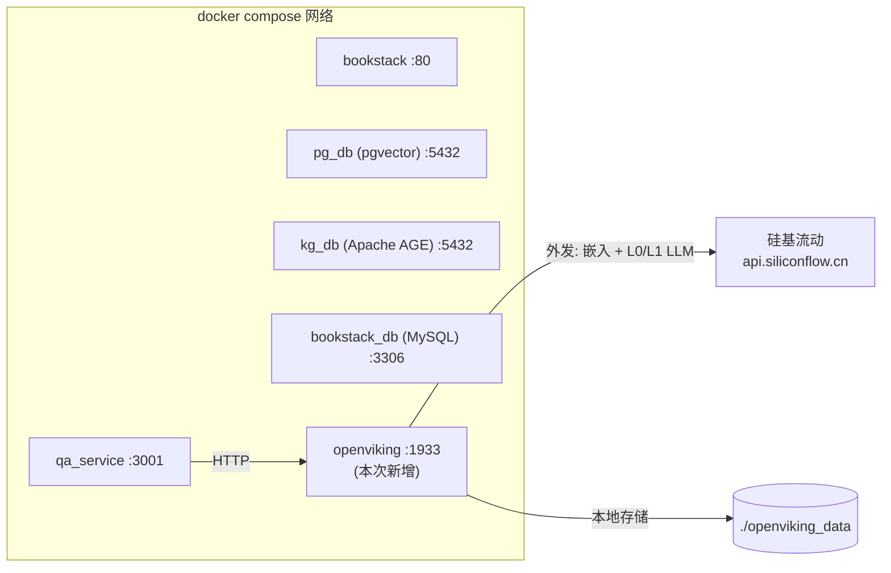

# OpenViking Sidecar — Design

> 配套 explore.md 的技术设计。版本 v0.1，对应 impl-plan v0.1。

---

## 1. 部署拓扑



要点：
- openviking 是**独立容器**，不依赖任何已有数据库，自己用本地文件 + 内置向量索引（开源版默认是嵌入式，不挂 pg）。
- qa_service 通过**容器内域名** `http://openviking:1933` 调用，本机调试用 `http://localhost:1933`。
- 外发只去硅基，和 qa-service 一样走 `EMBEDDING_BASE_URL`/`EMBEDDING_API_KEY`，**不需要新增 secret**。

## 2. 数据空间约定

强制目录前缀，client 层硬编码，不接受外部传：

```
viking://user/<principal.id>/preferences/...    # 用户偏好（语言、口吻、领域）
viking://user/<principal.id>/entities/...        # 用户提到过的实体（公司/产品/人）
viking://user/<principal.id>/sessions/<sid>/...  # 单次会话历史 + 摘要
viking://agent/knowledge_qa/skills/...           # Agent 通用技能（共享，所有用户可读）
viking://agent/knowledge_qa/templates/...        # 提示词模板
```

不写 `viking://resources/` ——本轮 BookStack Page 不同步进 viking。

## 3. qa-service 集成点

只改一个文件：`apps/qa-service/src/agent/agents/KnowledgeQaAgent.ts`。

```ts
async run(ctx) {
  // 1. 召回历史记忆 (软超时 200ms，失败降级)
  const memories = await viking.recallMemory({
    question: ctx.question,
    principalId: ctx.principal.id,
    sessionId: ctx.session_id,
    timeoutMs: 200,
  })
  if (memories.length) {
    ctx.emit({ type: 'viking_step', stage: 'recall', count: memories.length })
    // 把 L1 overview 拼成 system 注入到 history 头部
    ctx.history = [
      { role: 'user', content: `[memory]\n${memories.map(m => m.l1).join('\n---\n')}` },
      ...ctx.history,
    ]
  }

  // 2. 跑原有 RAG 管线（不动）
  await runRagPipeline(ctx.question, ctx.history, ctx.emit, ctx.signal, {
    spaceId: ctx.spaceId,
    principal: ctx.principal,
  })

  // 3. fire-and-forget 写记忆（不 await，不阻塞）
  void viking.saveMemory({
    principalId: ctx.principal.id,
    sessionId: ctx.session_id,
    question: ctx.question,
    // answer 由 ragPipeline emit 出去，这里不再持有；可以从 ctx 里收集后回写
  }).catch(err => {
    console.warn('[viking] save failed (non-fatal):', err.message)
  })
}
```

## 4. vikingClient 模块

`apps/qa-service/src/services/viking/`：

```
viking/
├── client.ts      # axios 包装：health / write / find / read / ls
├── types.ts       # OpenViking 响应类型
├── memoryAdapter.ts  # recallMemory / saveMemory 业务封装
└── index.ts       # 统一导出
```

行为契约：

| 函数 | 行为 | 失败策略 |
|---|---|---|
| `viking.health()` | 启动时探活，写日志 | 不抛，返回 false |
| `viking.recallMemory({question, principalId, ...})` | 限定 `viking://user/<id>/` 范围 find，返回 top-K L1 | 软超时 200ms，超时返回 [] |
| `viking.saveMemory({principalId, sessionId, question, answer})` | write 到 `viking://user/<id>/sessions/<sid>/<ts>.md` | 软超时 1000ms，失败 WARN 不抛 |
| `viking.ls(path)` / `viking.read(uri)` | 调试用，先不接路由 | — |

`VIKING_ENABLED=0` 或 health 失败时，所有方法直接返回空值/false，主链路零感知。

## 5. SSE 事件扩展

新事件，旧客户端忽略：

```jsonc
{ "type": "viking_step", "stage": "recall", "count": 3 }
{ "type": "viking_step", "stage": "save", "uri": "viking://user/123/sessions/abc/1714..." }
```

## 6. 环境变量

| 变量 | 默认 | 用途 |
|---|---|---|
| `VIKING_ENABLED` | `0` | 总开关，0 时 client no-op |
| `VIKING_BASE_URL` | `http://openviking:1933`（容器内）/ `http://localhost:1933`（dev） | qa-service 调 viking |
| `VIKING_API_KEY` | 空 | 启动 viking 时随机生成；空字符串走"无认证 dev 模式" |
| `VIKING_RECALL_TIMEOUT_MS` | `200` | recall 软超时 |
| `VIKING_SAVE_TIMEOUT_MS` | `1000` | save 软超时 |

OpenViking 容器自身用：

| 变量 | 默认 | 用途 |
|---|---|---|
| `OPENAI_BASE_URL` | `${EMBEDDING_BASE_URL}` | 让 viking 调硅基 |
| `OPENAI_API_KEY` | `${EMBEDDING_API_KEY}` | 复用密钥 |
| `OPENAI_MODEL` | `Qwen/Qwen2.5-72B-Instruct` | L0/L1 摘要模型 |
| `OPENAI_EMBEDDING_MODEL` | `${OPENAI_EMBEDDING_MODEL:-Qwen/Qwen3-Embedding-8B}` | 向量模型 |

## 7. 降级矩阵

| 故障点 | 表现 | 用户感知 |
|---|---|---|
| `VIKING_ENABLED=0` | 全部 no-op | 无 |
| openviking 容器没起 | health() 返回 false，client 降级 | 一次启动 WARN |
| recall 200ms 超时 | 返回 []，不注入 system context | RAG 走原路径 |
| save 1000ms 超时 | console.warn 一次 | 无（fire-and-forget） |
| 硅基限流 | viking 内部 L0/L1 失败，写入降级到只存原文 | 下次 recall 命中率下降 |

## 8. 不在本轮做但要留口子

- viking 数据导出 / GDPR 删除接口（生产化前必须做）
- recall 时按 Permissions V2 二次过滤（只在 `agent.knowledge_qa.requiredAction === 'READ'` 范围内）
- mcp-service 暴露 `viking_search` 工具给外部 Agent
- BookStack Page 同步成 `viking://resources/` 结构
- L0 摘要回写到 pgvector 旁路表（方案 B 才做）

---
